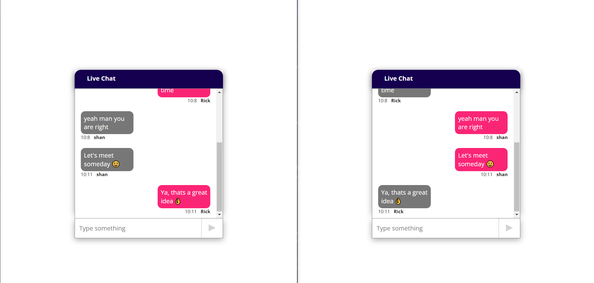

# Chatz

This is a Real-Time P2P chat application made using **ReactJS**. The real time feature has been achieved using Socket_io library. Create seperate unlimited Rooms and user

#### 🛠 How to install and run

- clone the repository `git clone`
- After cloning, download the required dependencies `npm i`, for both server side and client side.
- After all the installation, Run the servers
- Command for running `npm start`

#### Screenshot of the application

---

:heart::smile:**Thank you for your visit** :smile::heart:
Do give star in this repository :star:

### Created and written by [Arkajit Roy](https://github.com/arkajitroy) :point_left:
